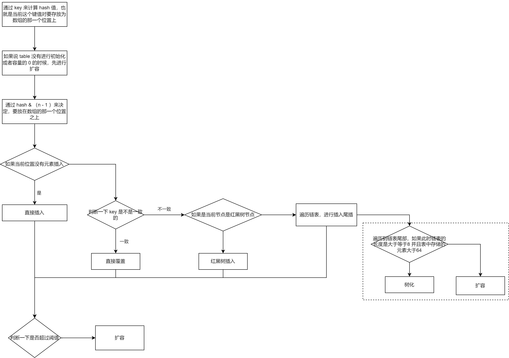
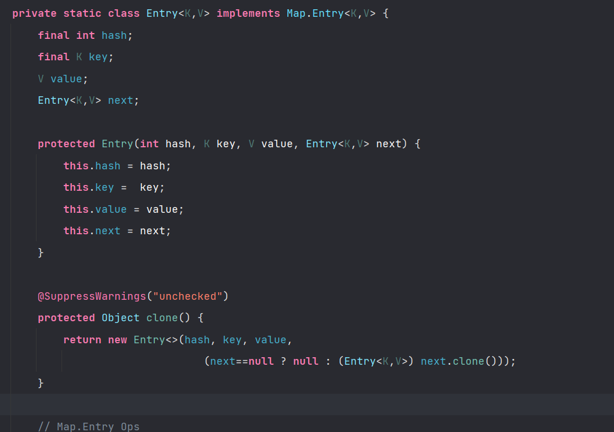
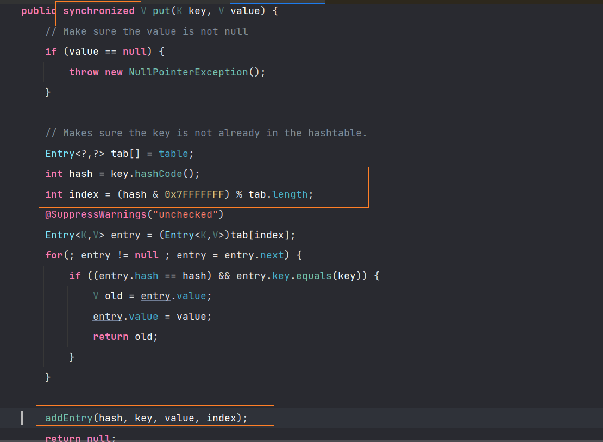
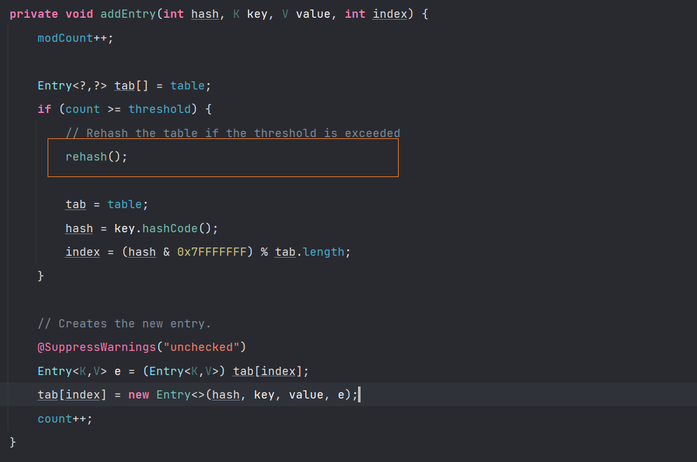
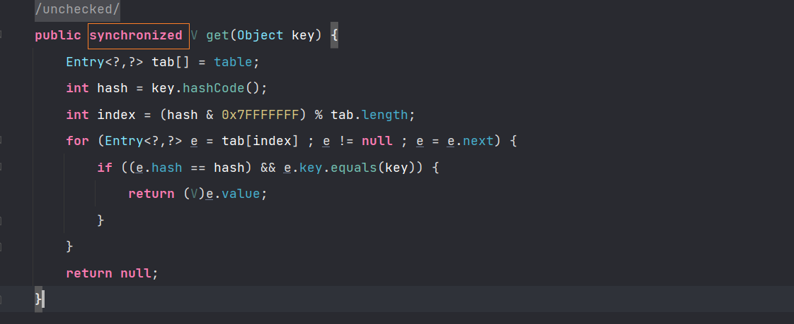
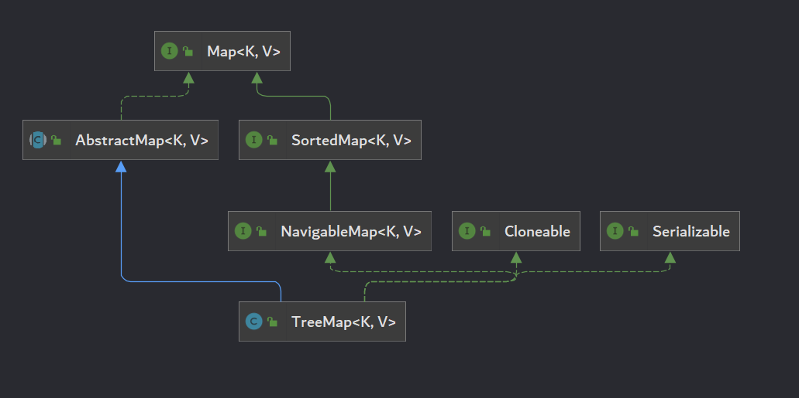
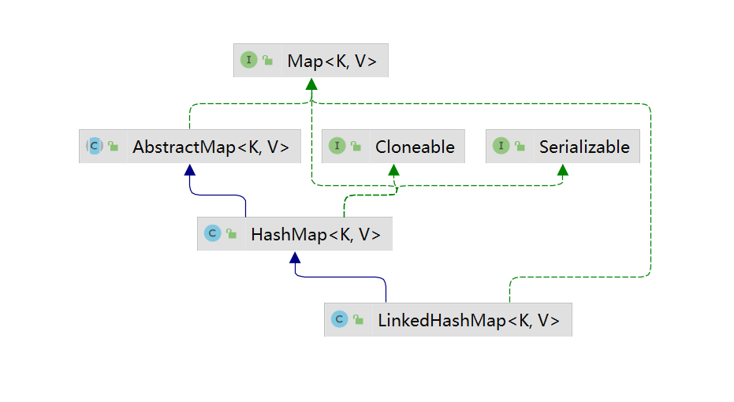
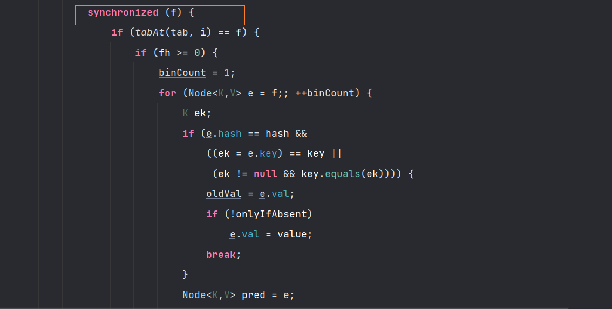
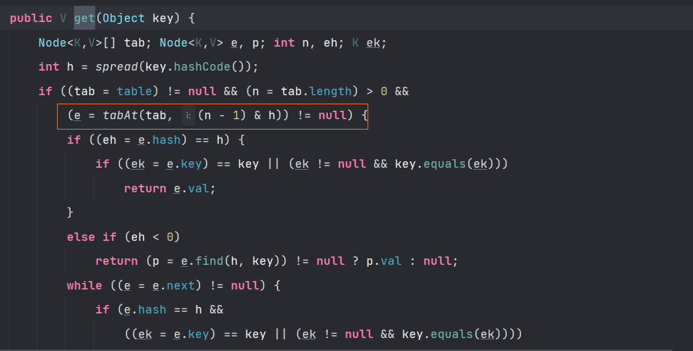

# Map

## 一、HashMap

散列表，平常也叫做哈希表，用数组的方式支持按照下标进行数据访问的特性，比如说我们每个人都存在一个《身份证，姓名》的映射关系，我们需要把这个键值对存放在我们的数组中去，来提供O(1)访问的特点，但是身份证号太长了，我们需要先将身份证号和数组的下标通过某种方式进行转换，然后在再指定位置下标之上放上我们的姓名即可。每次访问的时候，我们需要我们先将身份证号进行某种转化，然后拿这个转换之后的结果，去指定位置进行取就行了。这种转化方式我们称之为《散列函数》

因为数组的长度是有限的，可能会出现多个点映射到同一个位置的情况，为了解决这种冲突，可以采用**<font style="color:#2F54EB;">开放地址法</font>**和**<font style="color:#2F54EB;">链地址法</font>**等来解决问题。Java中 **HashMap采用了链地址法**。所以这里只对这种方式进行说明。

::: tip

链地址法，简单来说，就是 数组 加 链表 的结合。在每个数组元素上都对应一个链表结构，当数据被 Hash 后，得到数组下标，把数据放在对应下标元素的链表上。

:::

如果说 hash函数散列程度不够高，就会导致大部分的 key 都映射到同一个点之上，就会导致对应数组位置之上的链表过长，时间复杂度就会变成O(n)，在 JDK 1.7 的时候，就采用这种方式，在 JDK 1.8 的时候，对于这部分内容进行了优化 使用  **数组 + 链表 + 红黑树** 的实现方式，如果说链表的长度超过某个值，就会使用红黑树，用红黑树之后，会达到 O(logn)。

通过上面的分析，我们会有两个问题

+ 到底采用什么样的 Hash 方式？
+ 转为红黑树，什么时候进行转？为什么不直接使用红黑树？

### 1.1 哈希函数


通过这样，我们就能看出，他首先通过 key 的 hashCode 方法，返回一个int值，如果说直接使用这个值进行映射的话，就会导致我们数组过大，内存也是放不下的，得不偿失。

**<font style="color:#EB2F96;">注意，这里的key如果是0，hash值是0，说明HashMap中能够进行 null 值存放</font>**

本质就是通过键的 hashCode  的高16位和低16位进行异或，使用扰动函数就是为了增加随机性，让数据元素更加均衡的散列，减少碰撞。

这个有一个需要补充的点，相比于其他的元素，String 类型更加的适合作为 HashMap 的 key，主要原因如下：

+ hashCode 方法要保证同一个对象调用该方法的时候都应该相同的值，String类型对该条件具有很好的支持，因为String对象的 hashCode 方法是根据String对象的内容计算的，并不是根据地址，在底层复写了hashCode方法
+ 并且创建字符串的时候，他的 hashCode 方法进行了缓存，不需要二次计算

### 1.2 属性
属性使用`transient`进行修饰，表示进行该字段不会进行序列化

```java
// 底层数组
transient Node<K,V>[] table;

//调用 entrySet方法之后， 用于保存缓存
transient Set<Map.Entry<K,V>> entrySet;

// 键值对的数量
transient int size;

// 修改次数
transient int modCount;

// 阈值
int threshold;

// 负载因子，用来衡量 HashMap 满的程度,也就说数据量达到多少之后进行扩容
final float loadFactor;
```

负载因子能够在一定程度之上，影响 HashMap的性能，因为，负载因子过大，就能说明散列表装填的元素更加的多，元素多了，就会导致链表过长，进而影响性能。如果说太小了，就会导致数据量稀释，空间浪费

注意，这里的数组是一个Node类型的，而Node是一个静态内存类，这里只列出他的属性，通过这个节点，我们就能够发现他是一个**<font style="color:#E8323C;">单链表</font>**

```java
static class Node<K,V> implements Map.Entry<K,V> {
    // 哈希值
    final int hash;
    
    // 键
    final K key;
    
    // 值
    V value;
    
    // 当前节点的下一个地址，通过这个来实现链表
    Node<K,V> next;  
}
```

### 1.3 构造函数
#### 1.3.1 无参构造
```java
public HashMap() {
    // 负载因子默认设置为 0.75
    this.loadFactor = DEFAULT_LOAD_FACTOR; 
}
```

```java
// 默认的负载因子是 0.75 数组默认大小是 16 
static final int DEFAULT_INITIAL_CAPACITY = 1 << 4;

static final float DEFAULT_LOAD_FACTOR = 0.75f;
```

在构造方法中，我们并没有发现`table`数组的初始化。所以在一般情况之下，我们就可以认为他是按照`懒加载`原则，在首次使用的时候被初始化，这个思路，在好多底层源码上都是这样实现的。

#### 1.3.2 指定容量和负载因子
```java
static final int MAXIMUM_CAPACITY = 1 << 30;

// 指定 容量 和 负载因子
public HashMap(int initialCapacity, float loadFactor) {
    // 如果说容量小于 0 ，直接抛出异常
    if (initialCapacity < 0)
        throw new IllegalArgumentException("Illegal initial capacity: " +
                                           initialCapacity);
    // 最大容量只能是 1 << 30 
    if (initialCapacity > MAXIMUM_CAPACITY)
        initialCapacity = MAXIMUM_CAPACITY;
    
    // 判断负载因子
    if (loadFactor <= 0 || Float.isNaN(loadFactor))
        throw new IllegalArgumentException("Illegal load factor: " +
                                           loadFactor);
    this.loadFactor = loadFactor;// 设置负载因子
    this.threshold = tableSizeFor(initialCapacity);// 计算阈值
}
```

对于阈值的计算，是通过容量来进行计算的，**计算出大于等于该容量的最小的 2 的整数次幂**。不断右移的目的在于，把二进制的各个位置之上都赋值为1

```java
static final int tableSizeFor(int cap) {
    // 用于解决 容量本身就是2 的 N 次方的情况
    int n = cap - 1;
    n |= n >>> 1;
    n |= n >>> 2;
    n |= n >>> 4;
    n |= n >>> 8;
    n |= n >>> 16;
    // 得到的值是一个低位全是1的值，最后返回的时候 +1，则会得到1个比 n 大的 2 的N次方。
    return (n < 0) ? 1 : (n >= MAXIMUM_CAPACITY) ? MAXIMUM_CAPACITY : n + 1;
}
```

对于这个一步，我们演示一下效果，我们写下如下代码，打印一下每次运算之后的二进制位

```java
private static void get(int x) {
    for(int i = 31; i >= 0; i--) {
        if(((x >> i) & 1) == 1) {
            System.out.print("1\t");
        } else {
            System.out.print("0\t");
        }
    }
    System.out.println();
}
public static void main(String[] args) {
    int n = 17- 1;
    get(n);
    n |= n >>> 1;
    get(n);
    n |= n >>> 2;
    get(n);
    n |= n >>> 4;
    get(n);
    n |= n >>> 8;
    get(n);
    n |= n >>> 16;
    get(n);
    //return (n < 0) ? 1 : (n >= MAXIMUM_CAPACITY) ? MAXIMUM_CAPACITY : n + 1;
}
```

如果我们将16作为参数进行传递


我们将17作为参数进行传递


通过演示，发现，该函数的目的最终会得到一个后几位都是1的数，也就是2的整数次幂，并且这个数是大于该参数的最小的二的整数次幂。其实就是，将该数从最高的哪一位开始后面所有的二进制位都填充为1，从填充17哪里就能非常容易看出来，配合上或运算的特性，

而对于减1的目的，我传入16，如果不减一，得到的是31，就是为了得到大于等于当前数的最小的2的整数次幂（最后返回的时候有加1的特点）

> 为什么要求数组的长度一定是2的整数倍？
>

+ 因为我们在进行key-->下标的映射过程之中，我们一般的想法是通过`hash % (n - 1)`,而底层是通过`hash & (length - 1)`，只有在2的倍数的情况之下，两种方案才是等价的
+ 另一个方面，是因为位运算的速度更加的快

#### 1.3.3 指定容量

```java
/**
* 构造方法：HashMap(int initialCapacity)
*/
public HashMap(int initialCapacity) {
    this(initialCapacity, DEFAULT_LOAD_FACTOR);
}
```

这里的构造方法，我们发现，实际上就是通过指定容量和负载因子的构造函数，这里的负载因子直接就是默认的。

#### 1.3.4 传入一个Map
```java
/**
* 构造方法：HashMap(Map<? extends K, ? extends V> m)
*/
public HashMap(Map<? extends K, ? extends V> m) {
    this.loadFactor = DEFAULT_LOAD_FACTOR;// 默认的负载因子计算 0.75 
    putMapEntries(m, false);
}
```

相比于之前的构造函数，这一次多了一步

```java
final void putMapEntries(Map<? extends K, ? extends V> m, boolean evict) {
    // 1. 计算出要放入的键值对的数量
    int s = m.size();
    if (s > 0) {
        // 如果说这个table是空的
        if (table == null) { // pre-size
            // 计算出所需要的table的最小容量
            // 数组容量 / 键值对的数量 > 负载因子
            // 键值对的数量 = 数组容量 / 负载因子，这里加一的目的就是下面int向下取整的问题
            float ft = ((float)s / loadFactor) + 1.0F;
            int t = ((ft < (float)MAXIMUM_CAPACITY) ?
                     (int)ft : MAXIMUM_CAPACITY);
            // 如果说这个 t 大于阈值，计算新的阈值
            //因为此时 table 未初始化，我们只需要保证 threshold 大于数组大小即可，
            // 在 put key-value 键值的时候，在去真正的初始化 table 
            if (t > threshold)
                threshold = tableSizeFor(t); // 计算阈值
        }
        // 如果table 已经被初始化了，并且说 s 大于 阈值，需要不断扩容，
        else if (s > threshold)
            resize();
        // 遍历m集合，把元素都给放进去
        for (Map.Entry<? extends K, ? extends V> e : m.entrySet()) {
            K key = e.getKey();
            V value = e.getValue();
            putVal(hash(key), key, value, false, evict);
        }
    }
}
```

### 1.4 扩容
当 HashMap 中 键值对   **达到阈值**  的时候，就要考虑   **扩容**。对于阈值的计算，引入了负载因子的概念。我们假设 HashMap 的数组容量为 capacity ，key-value 键值对数量为 size ，负载因子为 loadFactor 。那么，当 size / capacity > loadFactor 时，也就是数组的使用量比率到达 loadFactor 比例时

```java
final Node<K,V>[] resize() {
    // 旧的table数组
    Node<K,V>[] oldTab = table;
    // 获取旧的table数组的长度
    int oldCap = (oldTab == null) ? 0 : oldTab.length;
    // 获取以前的阈值
    int oldThr = threshold;
    int newCap, newThr = 0;
    /**
    * 1. 以前的容量是大于0的
    */
    if (oldCap > 0) {
        /**
        * 1.1 这个容量超过了允许的最大范围，不在允许扩容，设置阈值为int的最大值。
        */
        if (oldCap >= MAXIMUM_CAPACITY) {
            threshold = Integer.MAX_VALUE;
            return oldTab;
        }
        /**
        * 1.2 目标是两倍扩容，并且这个值不能超过最大容量；如果说旧的容量是 > 16的，
        * 将新阈值设置为原来的两倍，阈值 = 容量 * 负载因子，负载因子不发生变化，容量扩容为
        * 原来的两倍，所以只需要将以前阈值* 2，就能得到新的阈值
        */
        else if ((newCap = oldCap << 1) < MAXIMUM_CAPACITY &&
                 oldCap >= DEFAULT_INITIAL_CAPACITY)
            newThr = oldThr << 1; // double threshold
    }
    /**
    * 2. 在构造方法中，我们发现并没对table进行初始化 
    * 说明以前容量为空，也就是说table数组未进行初始化，进行初始化操作
    */
    // 2.1 构造时传入了容量，计算出来阈值
    else if (oldThr > 0) //初始容量设置为阈值
        newCap = oldThr;
    /**
    * 2.2 说明执行的是默认构造方法（只设置了负载因子），阈值 和 容量 都是0
    */
    else { 
        /**
        * 2.2.1 设置新的容量和阈值
        */
        newCap = DEFAULT_INITIAL_CAPACITY;
        newThr = (int)(DEFAULT_LOAD_FACTOR * DEFAULT_INITIAL_CAPACITY);
    }
    /**
    * 3. 如果说上面并没有计算出阈值，则进行计算
    */
    if (newThr == 0) {
        float ft = (float)newCap * loadFactor;
        newThr = (newCap < MAXIMUM_CAPACITY && ft < (float)MAXIMUM_CAPACITY ?
                  (int)ft : Integer.MAX_VALUE);
    }
    threshold = newThr;
    //4. 创建一个新的table数组
    @SuppressWarnings({"rawtypes","unchecked"})
    Node<K,V>[] newTab = (Node<K,V>[])new Node[newCap];
    table = newTab;
    // 5. 如果说以前的table数组不为null，要将旧的table数组复制到新的table数组中。
    if (oldTab != null) {
        for (int j = 0; j < oldCap; ++j) {
            Node<K,V> e;
            if ((e = oldTab[j]) != null) {
                oldTab[j] = null;
                if (e.next == null)
                    newTab[e.hash & (newCap - 1)] = e;
                else if (e instanceof TreeNode)
                    ((TreeNode<K,V>)e).split(this, newTab, j, oldCap);
                else { // preserve order
                    Node<K,V> loHead = null, loTail = null;
                    Node<K,V> hiHead = null, hiTail = null;
                    Node<K,V> next;
                    do {
                        next = e.next;
                        if ((e.hash & oldCap) == 0) {
                            if (loTail == null)
                                loHead = e;
                            else
                                loTail.next = e;
                            loTail = e;
                        }
                        else {
                            if (hiTail == null)
                                hiHead = e;
                            else
                                hiTail.next = e;
                            hiTail = e;
                        }
                    } while ((e = next) != null);
                    if (loTail != null) {
                        loTail.next = null;
                        newTab[j] = loHead;
                    }
                    if (hiTail != null) {
                        hiTail.next = null;
                        newTab[j + oldCap] = hiHead;
                    }
                }
            }
        }
    }
    // 6. 返回新创建的table数组
    return newTab;
}
```

通过分析 resize() 方法的源码，我们发现，该方法有两个职责

+ 创建初始存储表格
+ 在容量不充足的情况之下，进行扩容，目标是两倍

### 1.5 树化
> **为什么要进行树化？**
>

因为元素放置过程中，如果一个对象哈希冲突，都被放置到同一个桶里面，则会形成链表，而链表的查询是线性的，会严重影响存取的性能。

**<font style="color:#2F54EB;">这里有一点注意的是：进入树化的方法，并不是一定就是要进行树化，而是先判断数组的容量，如果说容量大于64才进行树化</font>**

> **为什么选择红黑树 而不是AVL**
>

+ AVL树是更加严格的平衡树，可以提高更加快速的查找速度，一般读取查找密集型任务，适合AVL树
+ 红黑树更加适合于插入和修改密集型任务
+ 通常，AVL树旋转比红黑树更加的难以调试

> **红黑树**
>

1. 每个节点不是红色就是黑色
2. 根节点是黑色的
3. 所有叶子节点都是黑色的
4. 每个红色节点的两个叶子节点都是黑色的，从每个叶子节点到根节点的所有路径之上不能有两个连续的红色结点
5. 从任意节点开始，其每个叶子节点的所有路径之上都包含相同数量的黑色节点

```java
static final int MIN_TREEIFY_CAPACITY = 64;

final void treeifyBin(Node<K,V>[] tab, int hash) {
    int n, index; Node<K,V> e;
    /**
    * 1. 如果 table 容量小于 MIN_TREEIFY_CAPACITY(64) ，则选择扩容
    */
    if (tab == null || (n = tab.length) < MIN_TREEIFY_CAPACITY)
        resize();
    /**
    * 2. 将 hash 对应的位置进行树化
    */
    else if ((e = tab[index = (n - 1) & hash]) != null) {
        // 顺序遍历链表，逐个转换成 TreeNode 节点
        TreeNode<K,V> hd = null, tl = null;
        do {
            TreeNode<K,V> p = replacementTreeNode(e, null);
            if (tl == null)
                hd = p;
            else {
                p.prev = tl;
                tl.next = p;
            }
            tl = p;
        } while ((e = e.next) != null);
        // 树化
        if ((tab[index] = hd) != null)
            hd.treeify(tab);
    }
}
```

这里我们对方法这块进行总结：

- 如果说 table 的容量是小于 64，进行扩容，而不是进行树化
- 当进行树化的时候，是将 hash 对应的位置进行遍历，转为 TreeNode 节点

### 1.6 添加单个元素




红黑树的复杂度是优于链表的，但是树节点所占的空间确实普通节点的两倍，综合考虑，只有在节点太多的时候，才会选择红黑树

**为什么选择8在进行树化？**

- 在理想情况之下，受到随机分布的 hashCode 影响，链表中的节点遵从泊松分布（单位时间内随机时间发生的概率），并且根据统计，链表中节点的数量是 8 的概率是接近于千分之一，此时链表的性能很差，所以在这种极端情况之下，才会把链表转为红黑树
- 达到8一定进行树化吗？

```java
public V put(K key, V value) {
    // hash 计算hash 值
    return putVal(hash(key), key, value, false, true);
}

final V putVal(int hash, K key, V value, boolean onlyIfAbsent, boolean evict) {
    
    Node<K,V>[] tab; // table 数组
    
    Node<K,V> p; // 对应位置上的Node节点
    
    int n, i;// 用 n 来表示数组的大小，用 i 来表示 对应table 中的位置
    
    /**
    * 1. 如果说 table 还没有进行初始化， 或者容量为0的时候，进行扩容
    */
    if ((tab = table) == null || (n = tab.length) == 0)
        n = (tab = resize()).length;
    /**
    * 2. 获取对应数组位置上的节点，如果说为 null， 直接建立一个节点
    * 	p 就表示对应位置上的节点，也就是说通过映射，映射到数组上的这个点
    */
    if ((p = tab[i = (n - 1) & hash]) == null)
        tab[i] = newNode(hash, key, value, null);
    else {
        /**
        * 3. 说明当前映射的位置上已经有其他元素了，就要处理 哈希冲突
        */
        Node<K,V> e; K k;
        /**
        * 3.1 这个时候如果说 映射到的这个点和我们要插入的点一样（哈希值一样并且 key相同），直接使用就行了
        */
        if (p.hash == hash &&
            ((k = p.key) == key || (key != null && key.equals(k))))
            e = p;
        /**
        * 3.2 如果说这个点 是 红黑树的节点，就插入树中
        */ 
        else if (p instanceof TreeNode)
            e = ((TreeNode<K,V>)p).putTreeVal(this, tab, hash, key, value);
        else { 
            /** 
            * 3.3 这个点是 链表中的点
            */
            for (int binCount = 0; ; ++binCount) {
                // 3.3.1 找到了链尾
                if ((e = p.next) == null) {
                    // 3.3.2 创建一个新的节点
                    p.next = newNode(hash, key, value, null);
                    // 3.3.3 如果说链表的长度 大于等于 8 ，进行树化
                    if (binCount >= TREEIFY_THRESHOLD - 1) // -1 for 1st
                        treeifyBin(tab, hash);
                    break;
                }
                // 如果说遍历到的这个 e 就是我们要找的，直接使用就行了
                if (e.hash == hash &&
                    ((k = e.key) == key || (key != null && key.equals(k))))
                    break;
                p = e;
            }
        }
        /**
        * 4. 找到了对应的节点，覆盖对应的value值
        */
        if (e != null) { // existing mapping for key
            V oldValue = e.value;
            if (!onlyIfAbsent || oldValue == null)
                e.value = value;
            afterNodeAccess(e);
            return oldValue;
        }
    }
    // 增加修改次数
    ++modCount;
    // 如果说长度超过阈值 ，进行扩容
    if (++size > threshold)
        resize();
    afterNodeInsertion(evict);
    return null;
}
```

### 1.7 移除单个元素
1. 计算 key 对应的哈希值
2. 查找到key对应数组中的Node节点

```java
public V remove(Object key) {
    Node<K,V> e;
    return (e = removeNode(hash(key), key, null, false, true)) == null ?
        null : e.value;
}

final Node<K,V> removeNode(int hash, Object key, Object value,
                           boolean matchValue, boolean movable) {
    // table数组
    Node<K,V>[] tab; 
    // hash值映射到的数组中对应的 Node节点
    Node<K,V> p;
    int n, index;
   
    if ((tab = table) != null && (n = tab.length) > 0 &&
        (p = tab[index = (n - 1) & hash]) != null) {
        Node<K,V> node = null, e; K k; V v;
        /**
        * 1. 查找hash映射到数组中的节点，如果说这个节点就是我们要找的，直接用
        */
        if (p.hash == hash &&
            ((k = p.key) == key || (key != null && key.equals(k))))
            node = p;
        /**
        * 2. 数组这个节点后面还跟这个节点,可能是链表，可能是树
        */
        else if ((e = p.next) != null) {
            /**
            * 2.2.1 如果说这个节点是树节点，从红黑树里面找
            */
            if (p instanceof TreeNode)
                node = ((TreeNode<K,V>)p).getTreeNode(hash, key);
            else {
                /**
                * 2.2.2 这个节点是链表中的节点
                */
                do {
                    if (e.hash == hash &&
                        ((k = e.key) == key ||
                         (key != null && key.equals(k)))) {
                        node = e;
                        break;
                    }
                    p = e;
                } while ((e = e.next) != null);
            }
        }
        /**
        * 3. 找到了Node节点，进行移除
        */
        if (node != null && (!matchValue || (v = node.value) == value ||
                             (value != null && value.equals(v)))) {
            /**
            * 3.3.1 从红黑树中移除
            */
            if (node instanceof TreeNode)
                ((TreeNode<K,V>)node).removeTreeNode(this, tab, movable);
            /**
            * 3.3.2 是链表的头结点
            */
            else if (node == p)
                tab[index] = node.next;
            /**
            * 3.3.2 查找的是链表的中间节点
            */
            else
                p.next = node.next;
            ++modCount;
            --size;
            afterNodeRemoval(node);
            return node;
        }
    }
    return null;
}
```

### 1.8 查找单个元素
1. 最为理想情况为`O(1)`，最坏情况之下是`O(logN)`

```java
public V get(Object key) {
    Node<K,V> e;
    // 计算 Hash值
    return (e = getNode(hash(key), key)) == null ? null : e.value;
}
final Node<K,V> getNode(int hash, Object key) {
    Node<K,V>[] tab; Node<K,V> first, e; int n; K k;
    /**
    * 1. 查找 hash值对应的table中的first 节点
    */
    if ((tab = table) != null && (n = tab.length) > 0 &&
        (first = tab[(n - 1) & hash]) != null) {
        /**
        * 2. 如果时候这点就是我们要找的直接返回
        */
        if (first.hash == hash && // always check first node
            ((k = first.key) == key || (key != null && key.equals(k))))
            return first;
        if ((e = first.next) != null) {
            /**
            * 3. 如果说是树，就从树中开始找
            */
            if (first instanceof TreeNode)
                return ((TreeNode<K,V>)first).getTreeNode(hash, key);
            do {
                /**
                * 4. 从链表开始找
                */
                if (e.hash == hash &&
                    ((k = e.key) == key || (key != null && key.equals(k))))
                    return e;
            } while ((e = e.next) != null);
        }
    }
    return null;
}
```

## 二、Hashtable
### 2.1 类图


### 2.2 属性




底层使用的哈希表进行实现，默认容量使用11，并不要要求是2的N次方

### 2.3 添加元素





通过阅读上述代码过程，我们发现以下信息：

+ 我们发现hashtable中键和值都是不能为null的
+ 方法上使用`synchronized`进行修饰
+ 扩容使用的是 `2N + 1`

> **为什么使用 2N + 1**
>

+ hashtable中的初始容量是11，key--> 数组下标映射是：`(hash & 0x7FFFFFFF) % tab.length;`，因为初始容量是11，是一个素数，在素数情况之下，key % m 在区间中均匀分布，后面扩容采用这种方式进行扩容，保证扩容之后仍然是一个素数

### 2.4 获得元素



### 2.5 与HashMap的区别
开放寻址法：就是从冲突的位置在接下来往下找，给冲突元素找一个空位

1. 两者继承的父类不同，Hashtable 是继承于Directory，并且HashMap是继承于AbstractMap
2. 安全性角度分析:Hashtable是线程安全的，大部分方法之上都使用synchronized来进行修饰，而HashMap并不是线程安全的
3. 是否提供contains方法：HashMap中把Hashtable的contains方法去除掉，改为了containsValue和containsKey，因为contains方法容易引起误解，Hashtable则保留了contains，containsKey，containsValue三个方法，其中contains和containsValue功能相同
4. key和value是否允许空值：在Hashtable中，key和value都不允许出现null值，但是HashMap中，允许键设置为null
5. hash方式不同:HashTable直接使用对象的hashCode，而HashMap则是重新计算一个hash值
6. 扩容方式是不同的：HashTable的初始容量是11，每次扩容则是2N+1，而HashMap中，则是使用两倍扩容
7. HashMap，在底层是基于数组 + 链表+红黑树进行实现的，非线程安全的，默认容量是16，允许有空的键和值
8. Hashtable，基于哈希表进行实现，线程安全的，默认容量是11，不允许有空键和值

## 三、TreeMap


`TreeMap `则是基于平衡二叉树（红黑树）的一种提供顺序访问的Map，与`HashMap `不同，他的get，put ，remove之类的操作都是 O(log(n))的时间复杂度，可以自定义排序规则，具体顺序可以由指定Comparator来决定，或者根据键的自然顺序来判断

> 对比HashMap 和 TreeMap
>

+ HashMap是基于数组 + 链表 + 红黑树 实现的，而TreeMap是基于红黑树实现的
+ 使用HashMap需要键对象明确定义hashCode和equals方法，为了优化Hashmap空间的使用，可以调整初始容量大小和扩容，而TreeMap没有这种选项
+ HashMap的时间复杂度是O(1)，而TreeMap主要是保证数据平衡，时间复杂度是O（logn）；
+ 两者都是线程不安全的
+ HashMap是无序的，而TreeMap是有序的
+ TreeMap适用于按照自然顺序或者自定义顺序遍历键的场景，而HashMap适用于Map中插入，删除和定位元素

## 四、LinkedHashMap
### 4.1 基本信息
+ 继承了HashMap，因此所有的Map功能都已经实现了，只需要实现自己的特殊功能就行了
+ 底层是 数组 + 链表+ 双向链表
    - 数组 + 链表 -----> HashMap结构
    - 双向链表----> 存储插入顺序
+ 实际上，LinkedHashMap 可以理解成是 LinkedList + HashMap 的组合。

### 4.2 类图


### 4.3 属性
在LinkedHashMap中，实现了一个自定义的Node节点，从这里就能够，看出就是一个双向链表

```java
static class Entry<K,V> extends HashMap.Node<K,V> {
    Entry<K,V> before, after;
    Entry(int hash, K key, V value, Node<K,V> next) {
        super(hash, key, value, next);
    }
}
```

```java
transient LinkedHashMap.Entry<K,V> head;// 第一个节点

transient LinkedHashMap.Entry<K,V> tail; // 最后一个节点
/**
* 是否按照访问顺序，可以在构造时指定
*/
final boolean accessOrder;
```

### 4.4 和HashMap的区别
1. LinkedHashMap 是继承于 HashMap，是基于HashMap 和 双向链表进行实现，双向链表是为了保证顺序
2. 都是线程不安全
3. HashMap是无序的，LinkedHashMap是有序的，这里的有序-->顺序，实际上有两种方式
    1. 插入顺序
    2. 访问顺序


```java
/**
* 访问顺序
* */
LinkedHashMap<Integer,String> map1 = new LinkedHashMap<Integer,String>(0,0.75f,true);
for(int i = 0; i < 10; i++) {
    map1.put(i,String.valueOf(i));
}

Set<Integer> keySetBefore = map1.keySet();
keySetBefore.forEach(x -> {
    System.out.print(x +"\t");
});

System.out.println();

map1.get(1);
Set<Integer> keySetAfter = map1.keySet();
keySetAfter.forEach(x -> {
    System.out.print(x +"\t");
});
```

## 五、线程安全的Map
> **为什么说HashMap是线程不安全的**
>

首先在HashMap的put方法之中，出现了++的操作，这个时候就不是线程安全的

**扩容时期取出的值可能不准确**，首先HashMap本身的容量就不是很大，如果不停的向map中添加新的数据，他会进行扩容，而在扩容的时候，他会新建立一个新的空数组，并且用旧的顶替新的数组，那么，在这个过程中如果有线程来获取值，很有可能取到null值

**key丢失**，同时put操作就会导致一个数据丢失，如果说两个key发生碰撞，并且两个线程同时判断这个位置是空，可以写入，所以这两个线程的两个不同的value便会添加到数组的同一个位置，就会只保留一个数据

**可见性，没有办法保证，**如果说一个线程向key放入了一个新的值，线程二在获取的时候，感知不到。

### 5.1 Collection.synchronizedMap

通过这种方式，获得的是加锁的Map


### 5.2 ConcurrentHashMap


> **为什么性能优于Hashtable**
>

+ `hashtable `类基本上所有的方法都是采用`synchronized`进行线程安全控制的，高并发场景之下效率就减低了
+ 在JDK7，ConcurrentHashMap是采用**<font style="color:#2F54EB;">分段锁</font>**的思想提升性能，将数据分为一段段存储。整个map结构是一个一个`Segment`组成，每个`Segment`代表部分或者是一段数据，这个类通过继承`ReentrantLock`来保证线程安全，每次加锁锁住的是一个`Segment`，每次加锁锁粒度更加细化；
+ 在JDK8中，底层使用Node数组 + 链表 + 红黑树，**并发安全的主要实现是通过对指定的Node节点加锁**，来保证数据更新的安全性，也减少了并发冲突的概率，使用CAS来保证读，并使用synchronized保证写

写操作



读操作




